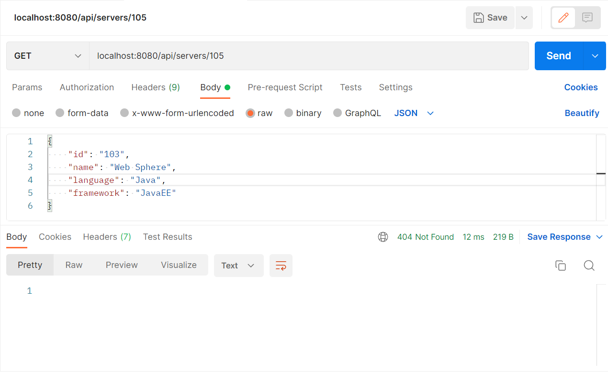

# Microservice-Project-Task1
Project Work for Microservice - AXYYA Digital
## Task 1 Java REST API Example  
Implement an application in java whichi provides a REST API with endpoints for searching, creating and deleting "Server" objects.  
- [x] GET servers.
  - [x] Should return all the servers if no parameters are passsed.   
     
  - [x] When server id is passed as a parameter, return a single server.  
    
  - [x] Return 404 if there's no such server found in the database.   
    
- [x] PUT a server.
  - [x] Add/Update : The server object is passed as json-encoded message body.   
    
- [x] Delete a server. The parameter is a server ID.  
    
- [x] GET(find) server by name. The parameter is a string, must check if a server name contains this string.   
  - [x] Return one or more servers found.
      
  - [X] Return 404 if nothing is found.
      
